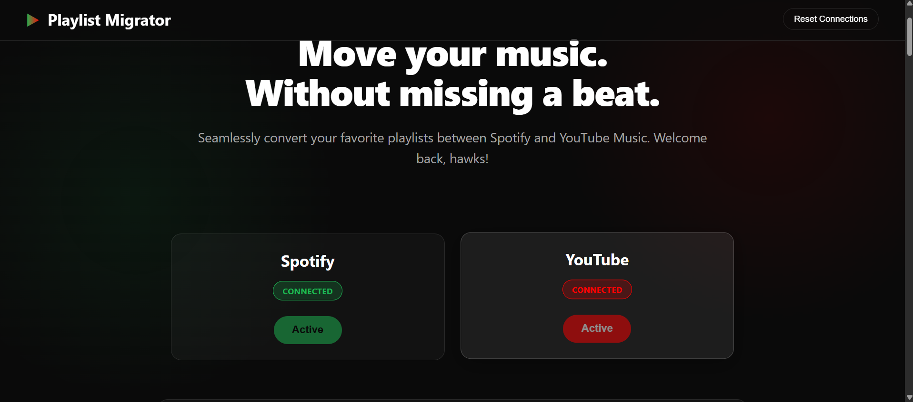
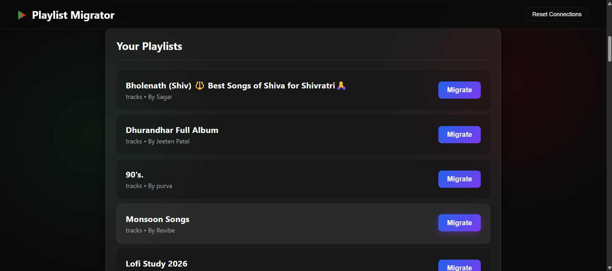
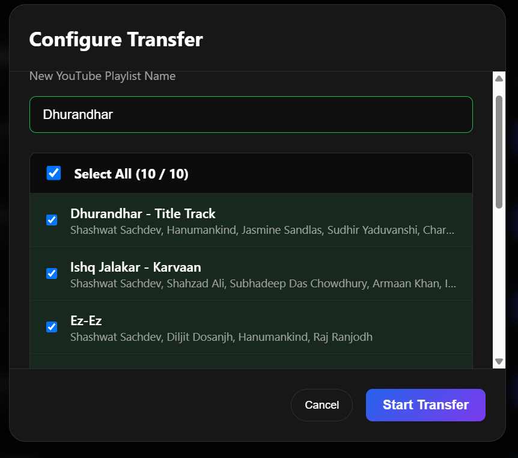
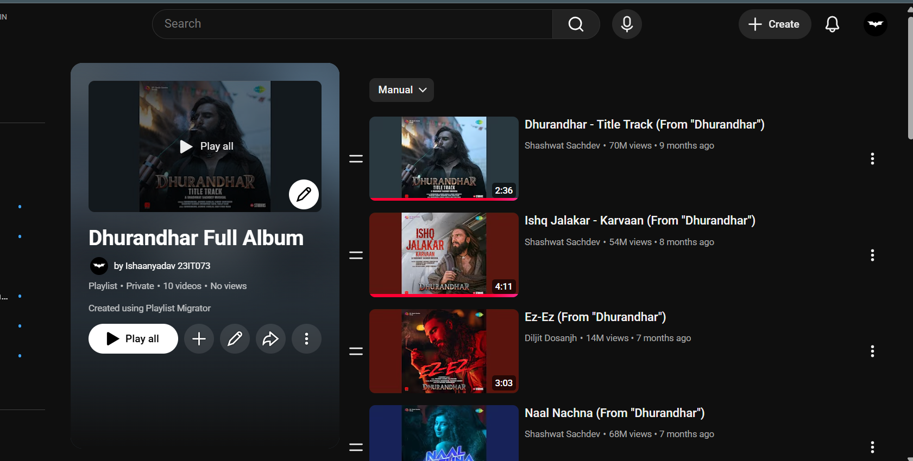

# Playlist Migrator: Full-Stack Automation Platform 🎵


A powerful, cross-platform utility that seamlessly migrates your private Spotify playlists directly to YouTube Music.

🔗 **[Live Demo](https://playlist-migrator-eta.vercel.app)**

## ✨ Features

- **Automated Migration**: Connect both your Spotify and Google accounts to automatically clone your entire playlist.
- **High-Accuracy Matching**: Uses the unofficial `ytmusic-api` to search for tracks, ensuring that the exact songs are matched rather than generic music videos.
- **Real-Time Progress**: Powered by Server-Sent Events (SSE), the UI displays a live progress bar as tracks are processed byte-by-byte in the background.
- **Interactive Manual Resolution**: If a track is blocked by YouTube or completely fails to match, the system catches the error and presents a fallback UI. Users can manually search for and select the correct track to ensure a 100% successful transfer rate.
- **Robust API Handling**: Engineered with intelligent delays and retry mechanisms to prevent YouTube Data API rate limits and playlist propagation errors (e.g., 404 Playlist Not Found).

## 🛠️ Tech Stack

- **Frontend**: React.js, Tailwind CSS / CSS, Vite
- **Backend**: Node.js, Express.js
- **Authentication**: OAuth 2.0 (Spotify & Google)
- **APIs**: Spotify Web API, YouTube Data API v3, ytmusic-api
- **Real-Time Data**: Server-Sent Events (SSE)
- **Deployment**: Vercel (Frontend), Render (Backend)

## 🚀 How It Works

1. **Authenticate**: Log in securely using OAuth 2.0 for both Spotify and Google.
2. **Fetch**: The backend pulls your Spotify profile and private playlists using the Spotify Web API.
3. **Analyze**: Select the playlist you want to migrate. The backend iterates through the tracks and searches YouTube Music for the closest, most accurate match.
4. **Create**: A brand new playlist is generated on your YouTube account.
5. **Transfer**: Tracks are injected one-by-one. Real-time progress is streamed back to the React frontend via SSE.
6. **Resolve**: Any tracks that fail to match automatically are sent back to the frontend, where you can manually resolve and add them!

## 💻 Local Setup

1. **Clone the repository:**
   ```bash
   git clone https://github.com/ISHAANYADAV8/playlist-migrator.git
   ```
2. **Setup the Backend:**
   - Navigate to the `backend` folder.
   - Run `npm install`.
   - Create a `.env` file and add your `SPOTIFY_CLIENT_ID`, `SPOTIFY_CLIENT_SECRET`, `GOOGLE_CLIENT_ID`, `GOOGLE_CLIENT_SECRET`, and `SESSION_SECRET`.
   - Run `npm start` or `npm run dev`.

3. **Setup the Frontend:**
   - Navigate to the `frontend` folder.
   - Run `npm install`.
   - Create a `.env` file and add your `VITE_BACKEND_URL`.
   - Start the development server with `npm run dev`.

## 📸 Screenshots & Demo

### 🏠 Home Page
Securely connect your Spotify and YouTube accounts.


### 📋 Select Your Playlist
View and select from your private Spotify playlists.


### ⚙️ Configure Transfer
Review the tracks, choose what to transfer, and start the migration!


### 🎉 Migration Complete
Your Spotify playlist is now seamlessly recreated on YouTube Music.


### 🎥 Demo Video

[Watch the Demo Video](link-to-video)

---
*Built by [Ishaan Yadav](https://github.com/ISHAANYADAV8)*
